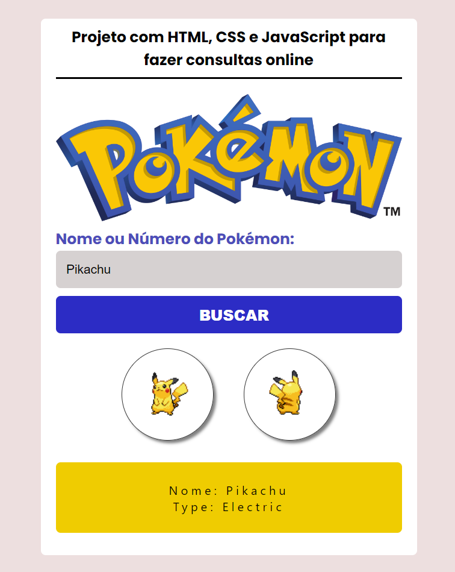

<h1 align="center"> Pokedex </h1>

  <a href="#-tecnologias">Tecnologias</a>&nbsp;&nbsp;&nbsp;|&nbsp;&nbsp;&nbsp;
  <a href="#-projeto">Projeto</a>&nbsp;&nbsp;&nbsp;|&nbsp;&nbsp;&nbsp;
  <a href="#-layout">Layout</a>&nbsp;&nbsp;&nbsp;|&nbsp;&nbsp;&nbsp;

 

  

## 🚀 Tecnologias

Esse projeto foi desenvolvido com as seguintes tecnologias:

- HTML 
- CSS
- JavaScript 
- API

## 💻 Projeto 

Este projeto é um buscador Pokémon que consome uma API externa que retorna o nome e o tipo do pokémon pesquisado. Projeto feito para praticar a manipulação e a integração de APIs com o JavaScript.

## 🔖 Layout

- Desktop: 1440px
